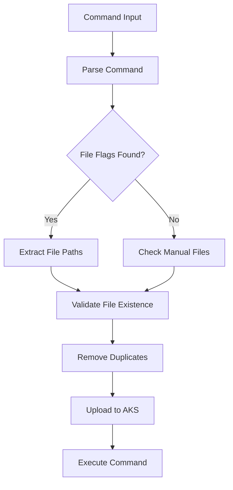

# XKS 🚀 - Azure Private AKS Command Wrapper 

[](https://golang.org/)
[](https://azure.microsoft.com/services/kubernetes-service/)
[](LICENSE)
[](https://github.com/open-factoryai/xks)

**XKS** is a powerful CLI tool that wraps `az aks command invoke` for running `kubectl` and `Helm` commands securely inside private AKS clusters. It provides an enhanced experience with automatic authentication, intelligent file handling, and simplified command execution.

## ✨ Features

- 🔐 **Automatic Authentication** - Service principal login with credential caching
- 🚀 **Cluster Management** - Start, stop, and check cluster status
- 📁 **Smart File Upload** - Automatic detection and upload of required files
- 🎯 **Direct Command Execution** - Run kubectl/helm commands without Azure CLI syntax
- ⚡ **Enhanced Experience** - Verbose output, error handling, and command result retrieval
- 🛡️ **Secure** - Works with private AKS clusters behind firewalls

## 📋 Prerequisites

- Azure CLI (`az`) installed and configured
- Go 1.21+ (for building from source)
- Access to an AKS cluster with command invoke permissions
- Azure Service Principal with appropriate permissions

## 🏗️ Installation

### Quick Install (Recommended)

```bash
# Download and run the install script
curl -fsSL https://raw.githubusercontent.com/open-factoryai/xks/main/scripts/install.sh | bash

# Or with custom install directory
curl -fsSL https://raw.githubusercontent.com/open-factoryai/xks/main/scripts/install.sh | bash -s -- -d ~/.local/bin
```

### Manual Install

```bash
git clone https://github.com/open-factoryai/xks.git
cd xks
go mod tidy
go build -o xks
sudo mv xks /usr/local/bin/
```

### Install Script Options

```bash
# Show help
./scripts/install.sh --help

# Install to custom directory
./scripts/install.sh -d ~/.local/bin

# Uninstall
./scripts/install.sh --uninstall
```

## ⚙️ Configuration

Create a `.env` file in your project directory:

```env
# Azure Service Principal
AZURE_TENANTID=your-tenant-id
AZURE_APPID=your-app-id
AZURE_SECRETID=your-secret
AZURE_SUBSCRIPTION=your-subscription-id-or-name

# AKS Cluster Info
AKS_RESOURCE_NAME=your-resource-group
AKS_NAME=your-aks-cluster
```

### 📊 Environment Variables Reference

| Variable | Description | Required | Example |
|----------|-------------|----------|---------|
| `AZURE_TENANTID` | Azure tenant ID | ✅ | `12345678-1234-1234-1234-123456789012` |
| `AZURE_APPID` | Service principal application ID | ✅ | `87654321-4321-4321-4321-210987654321` |
| `AZURE_SECRETID` | Service principal secret | ✅ | `your-secret-value` |
| `AZURE_SUBSCRIPTION` | Azure subscription ID or name | ✅ | `My Production Subscription` |
| `AKS_RESOURCE_NAME` | Resource group containing AKS cluster | ✅ | `my-rg-prod` |
| `AKS_NAME` | AKS cluster name | ✅ | `my-aks-cluster` |

## 🚀 Quick Start

### Cluster Management

```bash
# 🟢 Start AKS cluster
./xks start

# 🔴 Stop AKS cluster  
./xks stop

# ℹ️ Check cluster status
./xks status
```

### Basic kubectl Commands

```bash
# Get pods
./xks kubectl get pods

# Get all resources
./xks kubectl get all -A

# Apply configuration
./xks kubectl apply -f deployment.yaml

# Delete resources
./xks kubectl delete -f deployment.yaml
```

### Basic Helm Commands

```bash
# List releases
./xks helm list

# Install chart
./xks helm install my-app ./chart-directory

# Upgrade release
./xks helm upgrade my-app ./chart-directory --values values.yaml
```

## 📖 Usage Examples

### 🎛️ kubectl Examples

```bash
# 📋 Get resources
./xks kubectl get pods
./xks kubectl get services
./xks kubectl get deployments -n kube-system

# 📝 Apply configurations
./xks kubectl apply -f deployment.yaml
./xks kubectl apply -f file1.yaml -f file2.yaml
./xks kubectl apply -k ./kustomize-directory

# 🔍 Describe resources
./xks kubectl describe pod my-pod
./xks kubectl describe service my-service

# 📊 Scale deployments
./xks kubectl scale deployment my-app --replicas=5

# 🔗 Port forwarding
./xks kubectl port-forward svc/my-service 8080:80

# 📜 View logs
./xks kubectl logs -f deployment/my-app
./xks kubectl logs --since=1h my-pod

# 🖥️ Execute commands in pods
./xks kubectl exec -it my-pod -- /bin/bash
./xks kubectl exec my-pod -- env

# 🏷️ Label and annotate
./xks kubectl label pods my-pod environment=production
./xks kubectl annotate service my-service description="Main API service"

# 🔄 Rolling updates
./xks kubectl rollout status deployment/my-app
./xks kubectl rollout restart deployment/my-app
./xks kubectl rollout undo deployment/my-app
```

### ⚓ Helm Examples

```bash
# 📦 Repository management
./xks helm repo add bitnami https://charts.bitnami.com/bitnami
./xks helm repo update

# 🚀 Install applications
./xks helm install my-app ./charts/my-app
./xks helm install nginx bitnami/nginx
./xks helm install postgres bitnami/postgresql --values postgres-values.yaml

# 🔄 Upgrade releases
./xks helm upgrade my-app ./charts/my-app
./xks helm upgrade my-app ./charts/my-app --values prod-values.yaml --set image.tag=v2.0

# 📋 List and status
./xks helm list --all-namespaces
./xks helm status my-app
./xks helm history my-app

# ⏪ Rollback
./xks helm rollback my-app 1
./xks helm rollback my-app --revision=3

# 🗑️ Uninstall
./xks helm uninstall my-app
./xks helm uninstall my-app --keep-history

# 🧪 Testing and debugging
./xks helm install my-app ./charts/my-app --dry-run --debug
./xks helm test my-app
```

### 🎯 Advanced Usage

```bash
# 🔧 Using --command flag
./xks --command "kubectl get pods"
./xks --command "kubectl apply -f deployment.yaml" --file deployment.yaml

# 📤 Manual file specification
./xks --command "kubectl apply -f app.yaml" --file ./configs/ --file app.yaml

# 🔊 Verbose output
./xks -v kubectl get pods
./xks --verbose helm list

# ⏳ No-wait mode (for long-running commands)
./xks --no-wait kubectl apply -f large-deployment.yaml

# 📋 Custom output formats
./xks --output json kubectl get pods
./xks --output yaml kubectl get service my-service

# 🔍 Query results with JMESPath
./xks --query "items[?status.phase=='Running'].metadata.name" kubectl get pods -o json
./xks --query "spec.ports[0].port" kubectl get service my-service -o json

# 🐛 Debug mode
./xks --debug kubectl get pods
./xks --debug --verbose helm install my-app ./chart

# 📊 Get command results
./xks --get-result --command-id <command-id>

# 🌐 Azure CLI options passthrough
./xks --command "kubectl get pods" --output json --query "[?status.phase=='Running']"
```

## 📁 Smart File Detection

XKS automatically detects and uploads files referenced in your commands:

### 🎯 Automatic Detection

- **kubectl**: `-f`, `--filename`, `-k`, `--kustomize` flags
- **Helm**: Chart directories and values files
- **Manual**: Use `--file` to specify files/directories explicitly

### ✅ Examples

```bash
# ✅ Automatic file detection
./xks kubectl apply -f app.yaml

# ✅ Multiple files
./xks kubectl apply -f deployment.yaml -f service.yaml -f configmap.yaml

# ✅ Kustomize
./xks kubectl apply -k ./overlays/production
./xks kubectl apply -k ./base

# ✅ Helm charts
./xks helm install myapp ./charts/myapp
./xks helm upgrade myapp ./charts/myapp --values values-prod.yaml

# ✅ Complex scenarios
./xks kubectl apply -f ./k8s/ -k ./overlays/staging
./xks helm install app ./charts/app --values ./values/prod.yaml --values ./values/secrets.yaml
```

## 🏗️ Project Structure

<details>
<Summary>Click me !</Summary>

```
📁 xks/
├── 📄 main.go             # Point d'entrée
├── 📁 cmd/
│   └── 📄root.go          # Commandes CLI
├── 📁 azure/
│   ├── 📄config.go        # Configuration
│   ├── 📄auth.go          # Authentification
│   └── 📄command.go       # Exécution commandes
├── 📄 Makefile            # Automatisation build
├── 📄 .env.example        # Exemple configuration
└── 📄 README.md           # Documentation
```

*Note: The actual project structure may vary. Check the repository for the most current organization.*

## 🔧 Architecture

XKS consists of several key components:

- **AuthClient**: Handles Azure authentication and credential management
- **ClusterManager**: Manages AKS cluster lifecycle (start/stop/status)
- **CommandRunner**: Executes commands with intelligent file handling
- **Config**: Manages environment configuration and validation
- **FileDetector**: Smart file detection and upload optimization

### 🎯 Smart File Detection Algorithm


</details>

## 🌟 Real-World Scenarios

### 🚀 Application Deployment

```bash
# Complete application deployment
./xks kubectl create namespace myapp
./xks kubectl apply -f ./k8s/configmap.yaml
./xks kubectl apply -f ./k8s/secret.yaml
./xks kubectl apply -f ./k8s/deployment.yaml
./xks kubectl apply -f ./k8s/service.yaml
./xks kubectl apply -f ./k8s/ingress.yaml

# Check deployment status
./xks kubectl rollout status deployment/myapp -n myapp
./xks kubectl get pods -n myapp -w
```

### 📊 Monitoring and Debugging

```bash
# Resource monitoring
./xks kubectl top nodes
./xks kubectl top pods --all-namespaces

# Troubleshooting
./xks kubectl describe pod failing-pod
./xks kubectl logs -f deployment/myapp --previous
./xks kubectl get events --sort-by=.metadata.creationTimestamp

# Network debugging
./xks kubectl exec -it debug-pod -- nslookup my-service
./xks kubectl exec -it debug-pod -- curl -v http://my-service:8080/health
```

### 🔧 Configuration Management

```bash
# ConfigMaps and Secrets
./xks kubectl create configmap app-config --from-file=./config/
./xks kubectl create secret generic app-secrets --from-env-file=.env.prod

# Kustomize deployments
./xks kubectl apply -k ./overlays/development
./xks kubectl apply -k ./overlays/staging  
./xks kubectl apply -k ./overlays/production
```

### 🎛️ Helm Operations

```bash
# Complete Helm workflow
./xks helm create myapp
./xks helm lint ./myapp
./xks helm install myapp ./myapp --dry-run --debug
./xks helm install myapp ./myapp --wait --timeout=300s

# Production deployment
./xks helm upgrade myapp ./myapp \
  --values ./values-prod.yaml \
  --set image.tag=v1.2.3 \
  --set replicas=5 \
  --wait
```

## 🚨 Troubleshooting

### 🔐 Authentication Issues

```bash
# Test service principal credentials
az login --service-principal \
  --username $AZURE_APPID \
  --password $AZURE_SECRETID \
  --tenant $AZURE_TENANTID

# Verify permissions
az aks show --name $AKS_NAME --resource-group $AKS_RESOURCE_NAME
```

### 📁 File Upload Problems

```bash
# Use explicit file specification
./xks --command "kubectl apply -f app.yaml" --file app.yaml

# Check file permissions
ls -la app.yaml
chmod 644 app.yaml

# Debug file detection
./xks --debug -v kubectl apply -f app.yaml
```

### 🔍 Cluster Connection Issues

```bash
# Verify cluster status
./xks status

# Check cluster accessibility
az aks command invoke \
  --resource-group $AKS_RESOURCE_NAME \
  --name $AKS_NAME \
  --command "kubectl get nodes"
```

### ⏱️ Command Timeouts

```bash
# Use no-wait for long operations
./xks --no-wait kubectl apply -f large-deployment.yaml

# Check operation result later
./xks --get-result

# Increase timeout (if available)
./xks --timeout=600 kubectl apply -f complex-deployment.yaml
```

### 🐛 Debug Mode

Enable comprehensive debugging:

```bash
# Full debug output
./xks --debug --verbose kubectl get pods

# Save debug output
./xks --debug kubectl get pods 2>&1 | tee debug.log

# Check XKS version and config  
./xks version
./xks config show
```

## ⚠️ Limitations

- Requires Azure CLI to be installed and accessible
- Service principal must have `Azure Kubernetes Service Cluster User` role
- File uploads are limited by Azure's size restrictions (~4MB)
- Commands are executed in the context of AKS cluster's command service
- Network policies may affect certain kubectl operations
- Some interactive commands may not work as expected

## 🤝 Contributing

We welcome contributions! Here's how to get started:

### 🔧 Development Setup

```bash
# Fork and clone
git clone https://github.com/yourusername/xks.git
cd xks

# Install dependencies
go mod tidy

# Run tests
go test ./...

# Build locally
go build -o xks
```

### 📝 Contribution Guidelines

1. Fork the repository
2. Create a feature branch (`git checkout -b feature/amazing-feature`)
3. Make your changes
4. Add tests if applicable
5. Ensure all tests pass (`go test ./...`)
6. Commit your changes (`git commit -m 'Add amazing feature'`)
7. Push to the branch (`git push origin feature/amazing-feature`)
8. Open a Pull Request

### 🧪 Testing

```bash
# Run all tests
go test ./...

# Run tests with coverage
go test -cover ./...

# Run specific test
go test ./internal/auth -v
```

## 📄 License

This project is licensed under the MIT License - see the [LICENSE](LICENSE) file for details.

## 🆘 Support

- 🐛 **Issues**: [GitHub Issues](https://github.com/open-factoryai/xks/issues)
- 💬 **Discussions**: [GitHub Discussions](https://github.com/open-factoryai/xks/discussions)
- 📚 **Documentation**: [Wiki](https://github.com/open-factoryai/xks/wiki)
- 📧 **Email**: [open.factoryia@gmail.com](mailto:open.factoryia@gmail.com)

## 🌟 Acknowledgments

- Azure Kubernetes Service team for the command invoke functionality
- The Kubernetes and Helm communities
- All contributors and users of XKS

---

⭐ **If this project helps you, please give it a star!**

[](https://github.com/open-factoryai/xks/stargazers)
[](https://github.com/open-factoryai/xks/network)

Made with ❤️ by [FBO](https://fboukezzoula.github.io/)